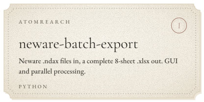
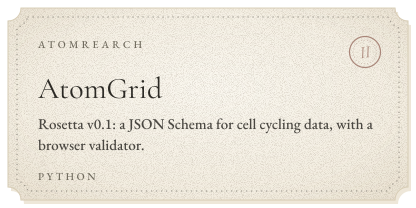
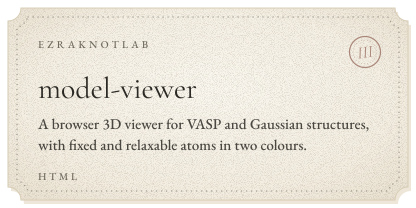
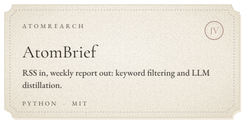
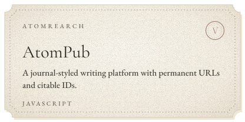
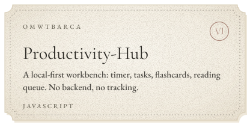
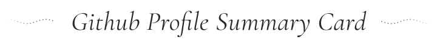

<picture>
  <source media="(prefers-color-scheme: dark)" srcset="./assets/banner-dark.svg">
  
</picture>

 

<i>Pride in Battle!🎉</i>

 

<picture>
  <source media="(prefers-color-scheme: dark)" srcset="./assets/section-about-dark.svg">
  
</picture>

I make small tools for reading, writing 
and handling data, and keep the notes 
they leave behind on a blog. 
Most of the work lives at <a href="https://github.com/AtomRearch">AtomRearch</a>; 
the rest is here and at <a href="https://github.com/EzraKnotLab">EzraKnotLab</a>.

<i>Now:</i> building <a href="https://github.com/AtomRearch/AtomBook">AtomBook</a>, a minimal 
single-file EPUB reader for the web, 
and maintaining <a href="https://github.com/AtomRearch/neware-batch-export">neware-batch-export</a>.

 

<picture>
  <source media="(prefers-color-scheme: dark)" srcset="./assets/section-work-dark.svg">
  
</picture>

<a href="https://github.com/AtomRearch/neware-batch-export"><picture><source media="(prefers-color-scheme: dark)" srcset="./assets/card-neware-dark.svg"></picture></a>
<a href="https://github.com/AtomRearch/AtomGrid"><picture><source media="(prefers-color-scheme: dark)" srcset="./assets/card-atomgrid-dark.svg"></picture></a>
<a href="https://github.com/EzraKnotLab/model-viewer"><picture><source media="(prefers-color-scheme: dark)" srcset="./assets/card-modelviewer-dark.svg"></picture></a>
<a href="https://github.com/AtomRearch/AtomBrief"><picture><source media="(prefers-color-scheme: dark)" srcset="./assets/card-atombrief-dark.svg"></picture></a>
<a href="https://github.com/AtomRearch/AtomPub"><picture><source media="(prefers-color-scheme: dark)" srcset="./assets/card-atompub-dark.svg"></picture></a>
<a href="https://github.com/omwtbarca/Productivity-Hub"><picture><source media="(prefers-color-scheme: dark)" srcset="./assets/card-hub-dark.svg"></picture></a>

<a href="https://github.com/AtomRearch">More on AtomRearch →</a>

 

<picture>
  <source media="(prefers-color-scheme: dark)" srcset="./assets/section-find-dark.svg">
  
</picture>

📧: <a href="mailto:omwtbarca@gmail.com">omwtbarca@gmail.com</a> 
(please feel free to mail me :) ) 
check more <a href="https://ezraknotlab.github.io/">My Blog</a>

 

<picture>
  <source media="(prefers-color-scheme: dark)" srcset="./assets/section-summary-dark.svg">
  
</picture>

<picture>
  <source media="(prefers-color-scheme: dark)" srcset="https://github-profile-summary-cards.vercel.app/api/cards/profile-details?username=omwtbarca&amp;theme=noctis_minimus">
  
</picture>
 
<picture>
  <source media="(prefers-color-scheme: dark)" srcset="https://github-profile-summary-cards.vercel.app/api/cards/profile-details?username=EzraKnotLab&amp;theme=noctis_minimus">
  
</picture>

<picture>
  <source media="(prefers-color-scheme: dark)" srcset="https://ssr-contributions-svg.vercel.app/_/omwtbarca?chart=3dbar&amp;gap=0.6&amp;scale=2&amp;flatten=2&amp;animation=wave&amp;animation_duration=3&amp;animation_delay=0.03&amp;animation_amplitude=24&amp;animation_frequency=0.1&amp;animation_wave_center=19_3&amp;format=svg&amp;weeks=40&amp;widget_size=medium&amp;dark=true&amp;colors=24201C,433830,74594E,A98679,D9B3A5">
  
</picture>

 

&ensp;

